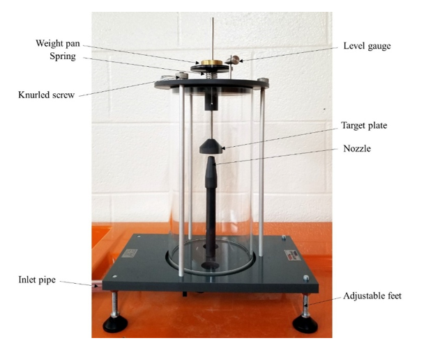

<b>Requirements (Instruments, Chemicals & Other) : </b> 
The set up primarily consists of a nozzle through which jet emerges vertically in such a way that it may be conveniently observed through the transparent cylinder. It strikes the target plate (flow detector) or disc positioned above it. An arrangement is made for the movement of the plate under the action of the jet and also because of the weight placed on the loading pan. Water enters vertically from the top of the cylinder, through a nozzle striking a target, mounted on a stem, and leaves through the outlet holes in the base of the cylinder. A scale (level guage) is provided to carry the plate to its original position i.e. as before the jet strikes the plate. A weight pan is mounted at the top of the stem to allow the force of the striking water to be counterbalanced by applied masses A collecting tank is utilized to find the actual discharge and velocity through nozzle.  

  

<b>Procedure : </b>  
1.	Note down the relevant dimensions as area of collecting tank and diameter of nozzle.  
2.	When jet is not running, note down the position of upper disc or plate.  
3.	Admit water supply to the nozzle. iv. As the jet strikes the disc, the disc moves upward, now place the weights to bring back the upper disc to its original position.  
4.	At this position find out the discharge and note down the weights placed above the disc.  
5.	The procedure is repeated for different values of flow rate by reducing the water supply in steps.

